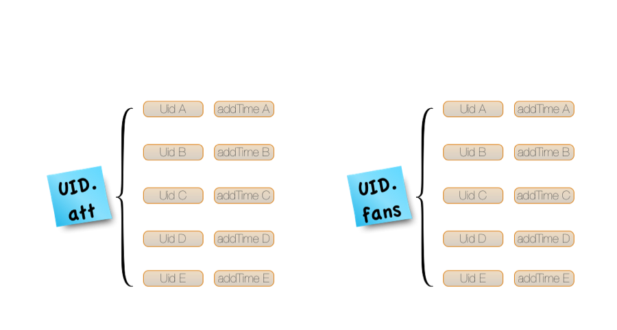

# Chap1 Redis数据结构

## 1、 List
### 1.1、简单介绍
除了Redis String外，List几乎是Redis最常用的数据结构了。它可以用来存储链表（有的地方也称作链表）结构，一般列表中的每个元素都是具有同类性质，比如Linux系统的用户对文件的读、写和执行权限就可以用list来存储。List支持的操作包括lpush、rpush、lpop、rpop、lindex（按索引获取元素）、lrange（区段查询）、llen（获取链表的长度）、lset（设置链表指定索引处为某个元素）、lrem、ltrim等。完整命令列表查看<a href="http://www.redis.cn/commands.html#list" target="_blank">Redis List</a>

其中lpush会使得先插入的元素排在链表最右端，从而先插入的元素的索引也比后插入的更大，可以想象始终从链表左部插入元素，如果左部头位置已有元素，则将链表中的已有元素都向右挪以腾出空位给待插入的新元素。

Java代码示例如下：

```java
Jedis jedis = null;
try {
	jedis = new Jedis("127.0.0.1");
	String key = "1000";
	
	// 存入
	jedis.lpush(key, "read");   // 返回值是long，表示插入后list中元素的数目
	jedis.lpush(key, "write");
	jedis.lpush(key, "execute");
	
	// 读取
	List<String> userPermissionNameList = jedis.lrange(key, 0/*start，包含start位置处元素*/, 
			-1/*end,-1表示最后一个元素*/);   // 取出list的所有元素
	System.out.println(userPermissionNameList);   // 输出list：[execute, write, read]
}
catch(Exception ex) {
	ex.printStackTrace();
}
finally {
	if(jedis != null) {
		jedis.close();
	}
}

```

### 1.2、实现方式
Redis List的底层实现是一个双链表，这样不但支持正向查找和遍历，还支持反向查找和遍历。

### 1.3、应用场景
有时我们需要处理一些顺序任务或者顺序消息，那么我们可以利用lpush和rpop来分别存和取任务或消息，然后进行处理（当然也可以使用rpush和lpop）。

此外，类似上面代码提到的一些比较稳定的列表类配置信息，比如开放平台中的用户默认最小权限列表信息，也很适合用Redis List来存储，而每次使用都需要取出整个列表的数据可以通过lrange key 0 -1来完成。

最后注意下List的一个特殊命令rpoplpush，它在某些场景下能发挥意想不到的效果，它主要用来删除列表的最后一个元素并插入到另一个列表的开头。经常我们会把Redis List当消息队列来使用，有的消息队列（比如订单消息队列）可能要求每条消息都**最终**被正确处理，那么就可以用到rpoplpush了，思路很简单：

* 消息消费者每次用rpoplpush命令从List的尾部删除一个消息（这个业务场景叫消息），并插入到另外一个备份List的头部
* 消息消费者正要处理取到的消息
  <br />a. 如果正确处理完成，则继续从备份List删除那条消息 
  <br />b. 如果正要处理时，突然程序崩溃，则在修复并重启程序后，消息消费者可以从备用List中取出那条消息继续处理，或者取出来再放回主List中去
  <br />c. 基于上面，我们同时可以做一个定时轮询任务，轮询备份List中的过期消息（每条消息都带上过期时刻），如果发现消息已过期则将这条消息放回主List中去

到了这里，有人（其实是我自己）可能会想到如果a中正确处理了消息，但正要从备份List删除消息时程序突然崩溃，那不就导致消息被重复处理了。我想到的一个解决方案就是保证消息处理的幂等性，比如有一条订单消息是这样的：
{ order_id: "1001", order_code: "a01", msg_expired_at: "2014-07-19 11:30:00"}
那么重复处理就重复处理好了，因为订单表肯定有一个订单状态字段，重复处理时会发现订单已处理完成，则直接丢弃消息并删除备用List中的该订单消息，并不会带来什么副作用。

此处关于rpoplpush参考了<a href="http://www.cnblogs.com/stephen-liu74/archive/2012/02/14/2351859.html" target="_blank">这篇博客</a>的末尾部分，不过后面关于重复消息处理的问题和解决方案是我自己想到的，O(∩_∩)O

## 2、 Hash
### 1.1、简单介绍
Hash既可以是名词，也可以是动词。作为名词，它是一种常见的数据结构，作为动词，它是哈希函数运算的意思。Redis Hash是一种很方便的数据结构，它的Key和Redis List没啥区别，但Value却是一个哈希结构。比如用Redis Hash存储用户信息：


可以看到Hash包含两部分：field和value。Redis Hash支持的操作包括HGET、HSET、HMGET、HMSET、HEXISTS、HGETALL、HLEN、HDEL、HVALS。完整命令列表查看<a href="http://www.redis.cn/commands.html#hash" target="_blank">Redis Hash</a>

这里用最常见的HGET、HSET举例说明下：

```shell
> HSET user0 name jxq
> HSET user0 age 25
> HGET user0 name
> HGET user0 age
```


### 1.2、实现方式
Redis Hash的value在逻辑上看来是一个HashMap，但实际上有两种实现，当Redis Hash成员较小时，对应的value RedisObject采用类似一维数组的方式紧凑存储，而不会采用真正的HashMap结构，此时encoding为zipmap。当成员数据量增大到一定程度时会自动转成真正的HashMap，此时encoding为ht。

### 1.3、应用场景
Redis Hash的应用的最好例子就是我们都平时都很熟悉的微博了。微博的关系服务就是基于Redis Hash实现的。微博关系中大概包括：

* 我关注的人
* 我的粉丝
* 双向关注，即两个人互为对方的粉丝
* 我关注的人也关注他
* 他的粉丝还关注谁

微博按三个维度进行Redis Hash，一个用户关注维度、一个用户的粉丝维度、一个双向关注维度。下图示意了前两种：


左边表示用户关注，Key是[UID].att，Value的field是[UID]关注的用户，Value的value是关注时间，它可以用来在应用服务层进行根据关注时间对关注列表进行排序。

右边表示用户粉丝，Key是[UID].fans，Value的field是[UID]的粉丝，Value的value是被粉时间。

还少了一个(UID.bifollow （UID, addTime))的Hash。

下面看看使用这三个Redis Hash如何实现上面的微博关系：

* 我关注的人：HGETALL [me.UID].att
* 我的粉丝：HGETALL [me.UID].fans
* 和我互相关注的用户：HGETALL [me.UID].bifollow
* 判断我和另外一个用户的关系：HGET [me.UID].att [other.UID] && HGET [other.UID].att [me.UID]，即先查我的关注列表里有没有另外一个用户，然后查另外一个用户的关注列表里有没有我，再做一次联合关系判断
* 我关注的人也关注他：HGET [me.UID].att 交 HGET [other.UID].fans
* 他的粉丝还关注谁：[ for fan in HGET [other.UID].fans: do HGET [fan.UID].att ]

但是HGETALL在HASH的成员数目比较多时性能会比较差，可以调整Redis的hash-max-zip-size参数，或者在Redis前面再增加一层缓存挡挡。

此外对于少数用户，他们关注的用户数非常多，可能达到好几千，设置热缓存时非常耗时，而Redis又是单线程的，这会导致在十几毫秒内这个端口的Redis无法提供其他服务。微博采用的方法是定制Redis源代码，改写Hash底层实现解决的。

另外不知道大家有没有留意过，默认查看另外一个用户的粉丝只能查看前10页，这些都与技术实现限制有关。尽量在满足合理业务需求的情况下，以高效经济的方式实现业务。

此节示例大部分内容参考自：<a href="http://www.infoq.com/cn/articles/weibo-relation-service-with-redis " target="_blank">微博关系服务与Redis的关系</a>


